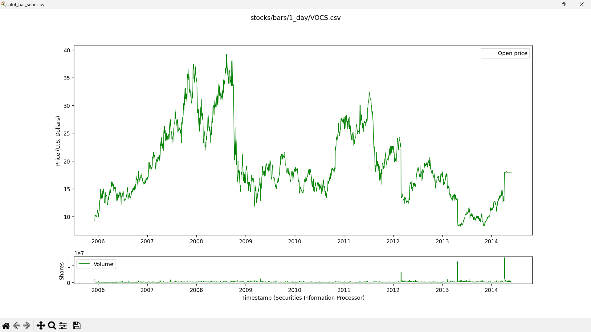
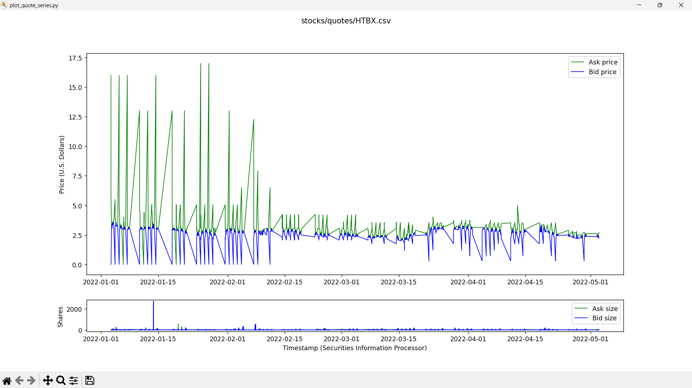
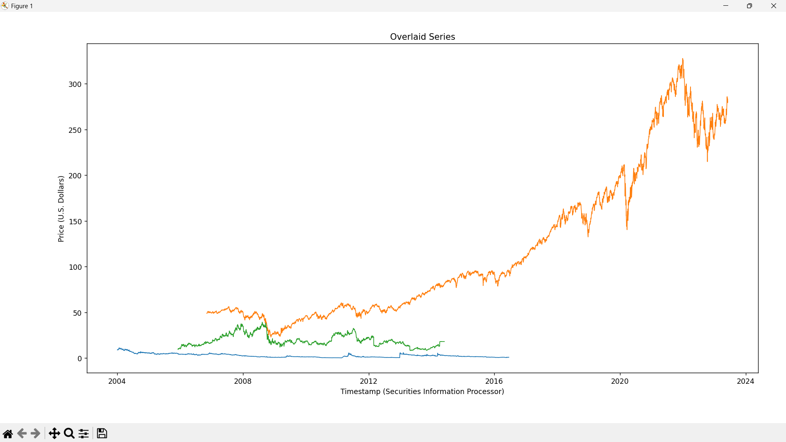

# Time Series Plotting

A collection of Python scripts for visualizing financial time series data in both quote, and bar formats.
The example data in the stocks folder is sourced from the [polygon.io API](https://polygon.io/docs/stocks)

# Getting Started

## 1. Install Python

Make sure you have `Python 3` installed to execute any of the scripts, as they were developed and tested using that version ([official python downloads page](https://www.python.org/downloads/))

## 1. Clone this Repo

`git clone <repo-path>`

## 2. Install Required Modules

`cd <repo-slug>`

`pip install -r requirements.txt`

## 3. Run a Script

`python ./plot_bar_series.py`

# Gallery

